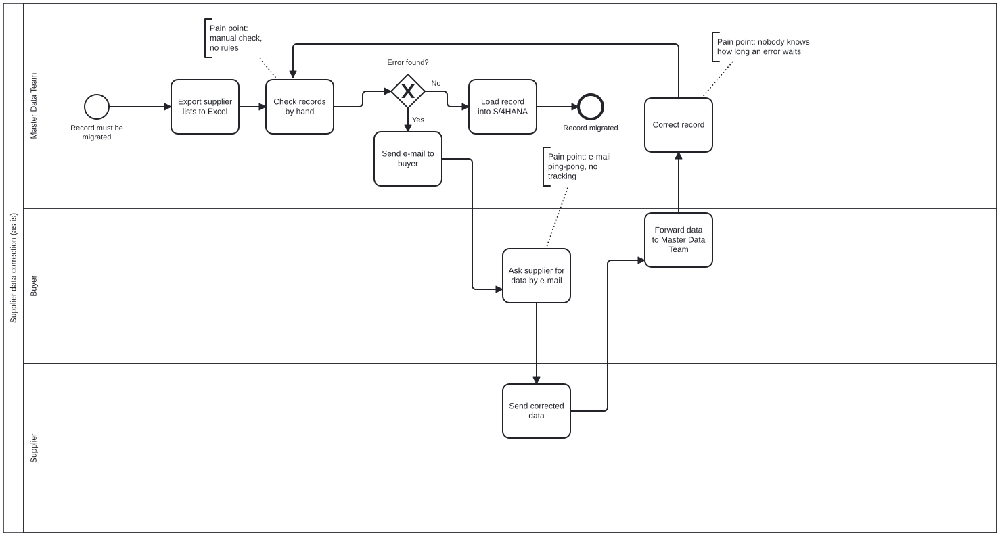
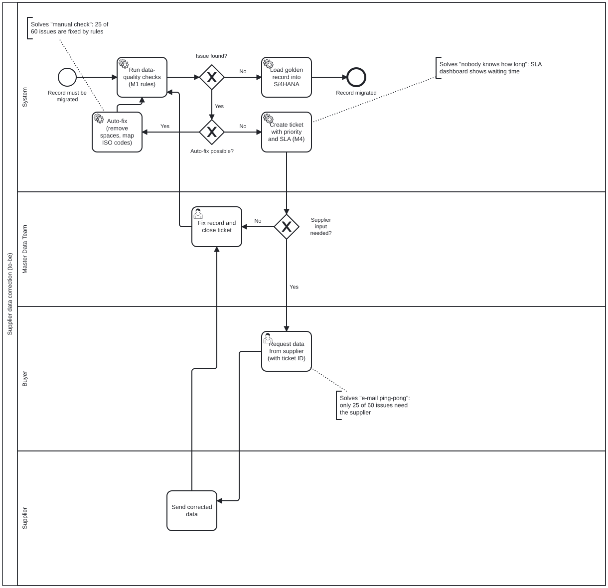
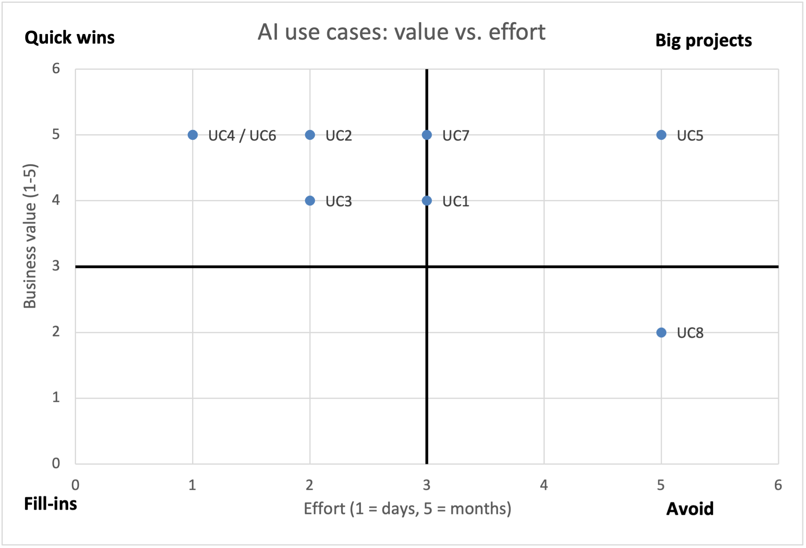

# Supplier Data Health Check for an SAP S/4HANA Migration

> **Work in progress (October 2026).** Screenshots and a short summary deck will follow.

A small portfolio project that simulates a common migration problem: two ERP systems (one SAP-like, one non-SAP) hold overlapping supplier master data that must be cleaned and merged into one system.

## Please note

- **All data is synthetic.** It is generated by `src/generate_data.py`. No real company, supplier or person data is used, and the project is not affiliated with any company.
- **AI-assisted development.** The Python code was written with an AI coding assistant (Claude Code). I directed the work, reviewed the results and am learning each step. The Excel ticket tracker in `excel/` is built by me, step by step; its commit history shows the progress.

## Modules

| Module | What it does | Status |
|---|---|---|
| M1 Data quality | Finds missing, inconsistent, invalid and duplicate supplier records; merges both ERPs into golden records | Done |
| M2 Supplier analysis | Supplier KPIs (on-time delivery, PPM, spend) and transparent KPI-based segments | Done |
| M3 Trustworthy AI | AI classifies quality complaints; results are measured against my own labels and a human-review rule | Done (first test) |
| M4 Ticket tracker (Excel) | Data-quality issues as tickets with formulas, KPIs and a dashboard | Done |
| Process analysis (BPMN) | As-is vs. to-be model of the supplier data correction process | Done |
| M5 AI use-case prioritization (Excel) | 8 AI ideas for the migration scored and ranked; value-vs-effort matrix | Done |

## M4: Excel ticket tracker (built by me)

`excel/BU2_Ticket_Tracker.xlsx` turns the 60 data-quality issues from M1 into tickets.
Created dates, status and owners are simulated.

- **Tickets sheet:** Excel Table `tblTickets`, frozen header, filters, dropdown lists (data validation) for Status and Priority
- **Formulas:** `XLOOKUP` (supplier segment from the M2 scorecard, SLA days per priority), `IF` + `TODAY` (ticket age), `IF` (SLA breached or OK)
- **Dashboard sheet:** KPIs with `COUNTA`, `COUNTIF` and `COUNTIFS`; conditional formatting; PivotTable by supplier segment and SLA status with a Status slicer
- **Example result (5 Oct 2026):** 39 of 60 tickets are open and 29 of them are past their SLA. The formula KPIs and the PivotTable give the same numbers.

## Process analysis: as-is vs. to-be (BPMN 2.0, drawn by me)

I modelled how supplier data errors are corrected today (as-is) and how the process works with the rules from M1 and the ticket tracker from M4 (to-be). Both models are in `docs/` as `.bpmn` (open them at bpmn.io) and `.svg`.

| | As-is | To-be |
|---|---|---|
| Checks | By hand in Excel | Rules (M1) run automatically |
| Issues that go to the supplier | All of them, by e-mail | 25 of 60 (the other 25 are fixed by rules, 10 internally) |
| Hand-offs between teams for a supplier issue | 4 (via the buyer both ways) | 3 (supplier answers directly with the ticket ID) |
| Tracking | None | Ticket with priority and SLA, dashboard (M4) |
| Manual tasks in the model | 7 | 3 |

The split of the 60 issues comes from the `suggested_action` column of M1's issue list. Times are not measured, because the data is synthetic.

**As-is**



**To-be**



## M5: Which AI idea first? (built by me)

`excel/AI_Use_Case_Prioritization.xlsx` lists 8 AI use cases for the migration (from duplicate detection to an agent that changes master data by itself).

- **I scored** each one from 1 to 5 on business value, data readiness, effort and risk, using the written guide in the `Scoring Guide` sheet.
- **Weighted score:** value 40%, data readiness 20%, effort 20% and risk 20%. Effort and risk count against an idea, so they are inverted with `6 - score`. Ranked with `RANK.EQ`.
- **Result:** complaint classification (already piloted in M3) ranks first. The auto-correcting master-data agent ranks last because it would change data without a human check. I raised the risk of the AI supplier summary because language models can invent numbers.
- The scores are my own judgement for a simulated company, not measured values.



## M3: Can we trust an AI to sort quality complaints?

1. 30 complaints were sampled (6 per category, 6 of them ambiguous). Texts include typos and German terms.
2. **I labelled them by hand** first, using a written labelling guide.
3. A **separate Claude session** that had seen neither the answer key nor my labels classified them with the prompt in `prompts/m3_classify_prompt.md`.
4. `src/m3_evaluate.py` compares both with the synthetic answer key and tests a review rule.

| | Correct (of 30) |
|---|---|
| AI | 30 |
| My labels | 21 (mistakes came from unfamiliar technical terms, e.g. salt spray test, 8D, VDA label) |

**Review rule:** the AI may decide alone only when its confidence is "high" and it sees no second category. On this test the rule sent 7 complaints to a human, including all 6 ambiguous ones; the 23 auto-assigned complaints were all correct.

**Limits:** the texts are short and synthetic, and the categories were defined by the same person who wrote them, so 30/30 is optimistic. Real complaints would need a new test before any use.

## Run

```bash
python -m venv .venv
.venv/bin/pip install -r requirements.txt
.venv/bin/python src/generate_data.py
.venv/bin/python src/m1_data_quality.py
.venv/bin/python src/m2_supplier_analysis.py
.venv/bin/python src/m4_export_tickets.py
.venv/bin/python src/m4_export_supplier_lookup.py
.venv/bin/python src/m3_make_labeling_sheet.py
.venv/bin/python src/m3_evaluate.py
```

`src/m4_export_tickets.py` writes the starting file `excel/BU2_Ticket_Tracker_start.xlsx`; the finished tracker was built from it by hand in Excel.
